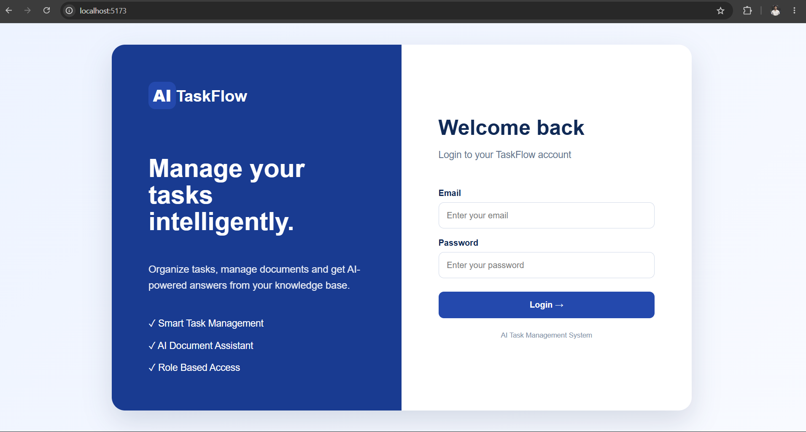
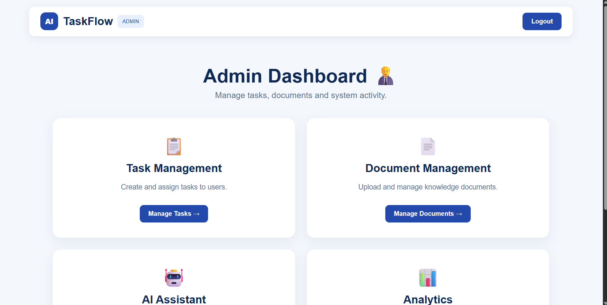
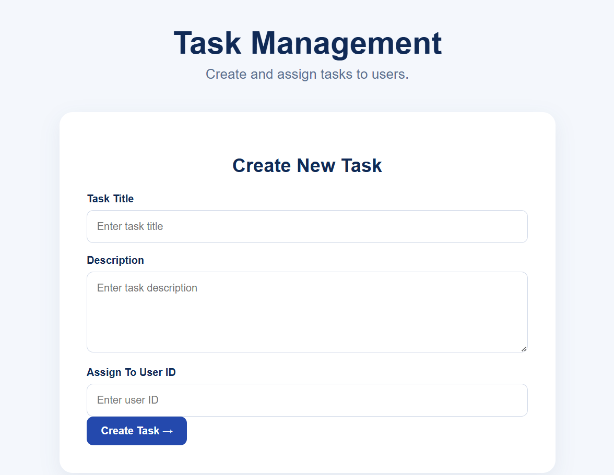
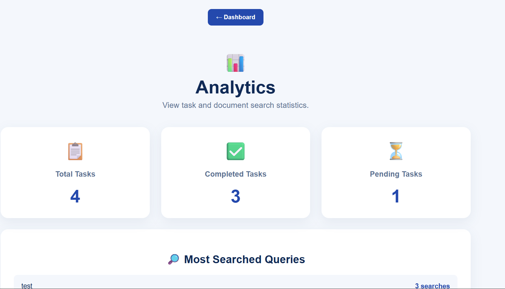
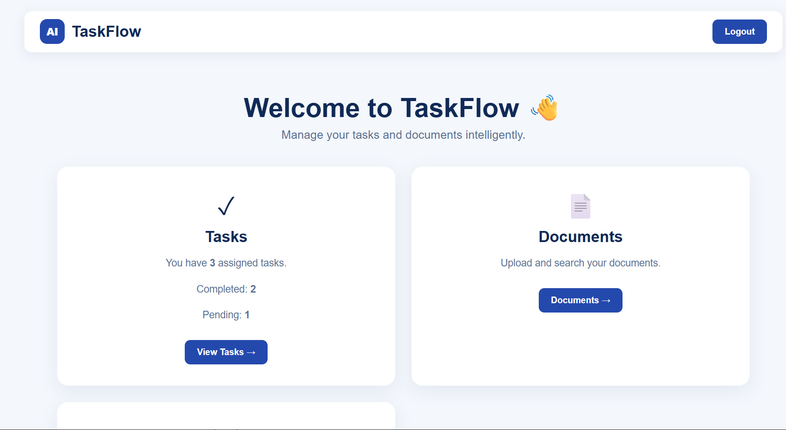

# AI Task Management System

An AI-powered task management system built using React.js, FastAPI, MySQL and FAISS.

The system provides role-based task management, document management and an AI document assistant that can answer questions using information from uploaded documents.

---

## Features

### Authentication
- User registration
- User login
- JWT-based authentication
- Secure password hashing

### Role-Based Access Control

The system has two roles:

#### Admin
- Create and assign tasks
- Upload documents
- Use AI Assistant
- View analytics
- Manage documents

#### User
- View assigned tasks
- Update task status
- Search uploaded documents
- Use AI Assistant

### Task Management
- Create tasks
- Assign tasks to users
- View assigned tasks
- Update task status
- Track pending and completed tasks

### Document Management
- Admin can upload PDF and TXT documents
- Uploaded documents are stored in the backend
- Documents are converted into text
- Documents are indexed using FAISS

### AI Document Assistant
- Users can ask questions about uploaded documents
- Relevant document chunks are retrieved using vector search
- AI generates an answer based on the retrieved content
- Relevant sources are returned with the answer

### Analytics
- Total tasks
- Completed tasks
- Pending tasks
- Most searched document queries
- Activity logging

---

## Technology Stack

### Frontend
- React.js
- JavaScript
- HTML
- CSS
- Vite

### Backend
- Python
- FastAPI
- SQLAlchemy
- JWT Authentication

### Database
- MySQL

### AI / Search
- FAISS
- Vector embeddings
- AI-powered document question answering

### Tools
- VS Code
- Git
- GitHub
- Postman

---

## System Architecture

```text
                    User
                     |
                     v
              React Frontend
                     |
                     v
              FastAPI Backend
                     |
        +------------+------------+
        |            |            |
        v            v            v
   Authentication   Tasks     Documents
        |            |            |
        |            |            v
        |            |       Text Extraction
        |            |            |
        |            |            v
        |            |       FAISS Index
        |            |            |
        |            |            v
        |            |       AI Assistant
        |            |
        +------------+------------+
                     |
                     v
                   MySQL


---
### Screenshots

### Login Page



### Admin Dashboard



### Admin Task Management



### Admin Analytics



### User Dashboard

